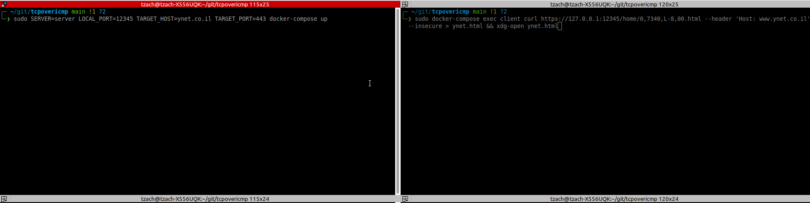

# TCP over ICMP

This project consists of two main parts:
### Client
The client used to allow TCP communication on TCP limited machines through ICMP tunneling. The client has two main goals:  
* Receiving TCP packets from the client, wrapping them in ICMP and sending to the server.  
* Receiving ICMP packets from the server, parsing them and sending TCP back to the client.

### Server
The tunnel server used to TCP communicate with the target host. The server has two main goals:  
* Receiving ICMP packets from the client, unwrapping them and sending TCP to the target.
* Receiving TCP packets from the target, wrapping them in ICMP and sending them back to the client.  


## Installation
Though not mandatory, it is highly recommended running the client and the server using a docker.


## Usage
usage: client.py [-h] --tunnel-server TUNNEL_SERVER --local-port LOCAL_PORT --target-host TARGET_HOST --target-port
                 TARGET_PORT  

### Example
```shell
# Running the client and the server as docker services (we use sudo because of the raw sockets)
sudo SERVER=server LOCAL_PORT=12345 TARGET_HOST=ynet.co.il TARGET_PORT=443 docker-compose up

# TCP over ICMP tunneling for the win!
sudo docker-compose exec client curl https://127.0.0.1:12345/home/0,7340,L-8,00.html --header 'Host: www.ynet.co.il'  --insecure
```



## Tests
I focused on manual integration system tests for both client and server.

## TODOs
* multi-threading support - client side
* multi-threading support - server side
